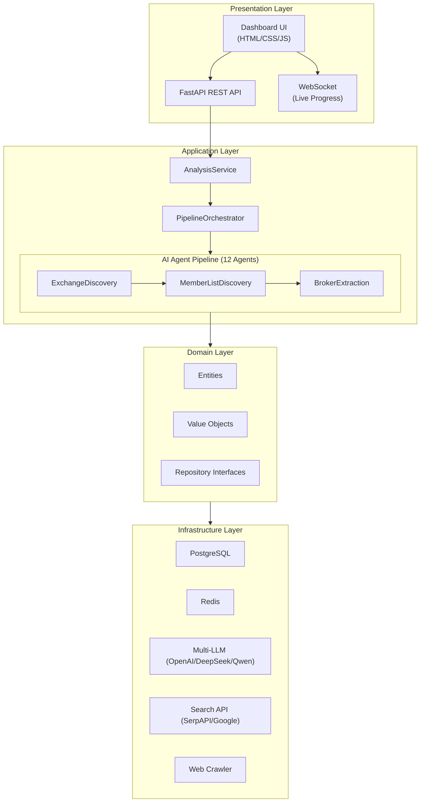

# FinTech Sales Intelligence Platform

An enterprise-grade, AI-powered Sales Intelligence Platform focused on the Financial Services industry.

This platform discovers financial institutions, analyzes their digital presence, identifies key decision makers, evaluates their technology stack, detects business opportunities, and generates actionable sales insights.

## Architecture

The application is built using **Clean Architecture** and **Domain-Driven Design (DDD)** principles.



## Features

- **Multi-LLM Support**: Switch between OpenAI, DeepSeek, Qwen, and local Ollama via `.env`.
- **12 Specialized AI Agents**: Each handles a single responsibility in the pipeline.
- **Premium Glassmorphism Dashboard**: Real-time WebSocket progress visualization.
- **Automated Web Crawling**: Respects `robots.txt` and rate limits.
- **Advanced Lead Scoring**: Multi-factor deterministic scoring algorithm.

## Getting Started

### Prerequisites

- Docker and Docker Compose
- Python 3.12+ (for local development)

### Environment Setup

1. Copy the example environment file:
   ```bash
   cp .env.example .env
   ```

2. Configure your API keys in `.env`:
   - Set `LLM_PROVIDER` (default is `openai`)
   - Add the corresponding API key (e.g., `OPENAI_API_KEY`, `DEEPSEEK_API_KEY`)
   - Set `SEARCH_PROVIDER` (default is `serpapi`)
   - Add the search API key (e.g., `SERPAPI_KEY`)

### Running with Docker

The easiest way to run the platform is using Docker Compose:

```bash
docker-compose up -d
```

This will start:
- FastAPI Application (Port 8000)
- PostgreSQL Database (Port 5432)
- Redis Cache (Port 6379)

### Accessing the Platform

- **Dashboard**: http://localhost:8000
- **API Documentation (Swagger)**: http://localhost:8000/api/docs
- **API Documentation (ReDoc)**: http://localhost:8000/api/redoc

## Development Workflow

To set up a local development environment:

```bash
# Create virtual environment
python -m venv .venv
source .venv/bin/activate  # On Windows: .venv\Scripts\activate

# Install dependencies
pip install -e ".[dev]"

# Run linters and type checkers
ruff check app/
mypy app/

# Run tests
pytest tests/
```
