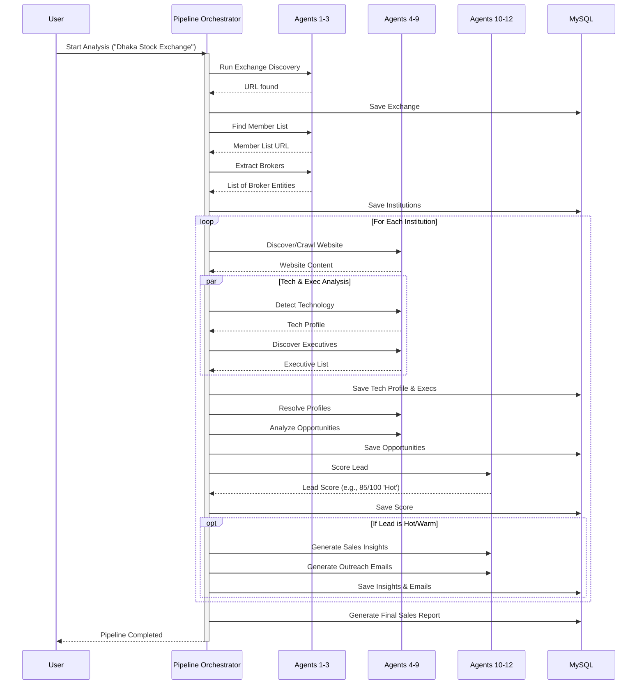

# Agent Process Flow

The FinTech Sales Intelligence platform uses a highly orchestrated pipeline of **12 specialized AI Agents**. Each agent operates on the Single Responsibility Principle, receiving structured input and returning structured output without side effects.

## The 12 Agents

1. **ExchangeDiscoveryAgent**: Finds the official website of the target stock exchange.
2. **MemberListDiscoveryAgent**: Locates the page containing the member/broker directory.
3. **BrokerExtractionAgent**: Extracts structured data (name, address, website) for all brokers.
4. **WebsiteDiscoveryAgent**: Finds official websites for brokers that lacked URLs in the directory.
5. **WebsiteCrawlerAgent**: Crawls the broker's public pages to extract text content.
6. **TechnologyDetectionAgent**: Analyzes extracted text to map the technology stack and digital maturity.
7. **ExecutiveDiscoveryAgent**: Identifies C-level executives and tech leaders from the website content.
8. **ProfileResolverAgent**: Resolves LinkedIn and Facebook URLs for the discovered executives.
9. **OpportunityAnalysisAgent**: Identifies specific software modernization opportunities based on tech gaps.
10. **LeadScoringAgent**: Calculates a deterministic lead score based on digital presence, tech score, and opportunities.
11. **SalesInsightAgent**: Generates an executive summary and personalized pitch strategy.
12. **EmailGenerationAgent**: Drafts highly personalized cold outreach emails for each executive.

## Execution Pipeline

The `PipelineOrchestrator` manages the lifecycle. It runs Agents 1-3 sequentially to discover the institutions, then fans out to run Agents 4-12 on each discovered institution.

## State Management and Fault Tolerance

-- **Database Persistence**: The orchestrator saves state to MySQL after every step. If the pipeline crashes, data up to that point is preserved.
- **Audit Logging**: Every agent execution is logged in the `audit_logs` table, recording tokens used, duration, and success/failure.
- **WebSocket Broadcasts**: The orchestrator broadcasts the `AnalysisStatus` via WebSocket, allowing the dashboard UI to show real-time progress bars for the 13 distinct pipeline stages.
- **Retry Logic**: All external network calls (search, crawling, LLM) use exponential backoff via the `@async_retry` decorator to handle transient failures gracefully.
